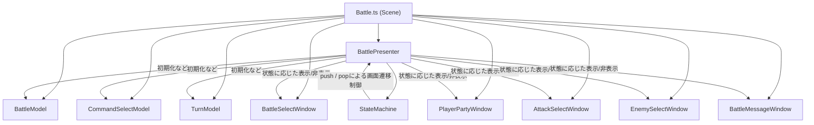

# Battleシーン実装ドキュメント

本ドキュメントでは、Phaserゲーム用[Battle.ts](file:///c:/Users/soushi/Desktop/game/app/%28game%29/scenes/Battle.ts)に適用されているMVP(Model-View-Presenter)パターンおよびステートマシンによる画面遷移の構造について説明します。

---

## 1. 全体構造の概要
Battleシーンでは、データの管理([Model](file:///c:/Users/soushi/Desktop/game/app/%28game%29/menu/model/MenuModel.ts#3-65))、画面の各種UI描画([View](file:///c:/Users/soushi/Desktop/game/app/%28game%29/menu/view/MenuView.ts#12-75))、進行・遷移の制御([Presenter](file:///c:/Users/soushi/Desktop/game/app/%28game%29/menu/presenter/MenuPresenter.ts#5-57))の3層が用いられ、さらにコマンドやターゲットを選択する際の画面フローを管理するために**ステートマシン**が導入されています。

---

## 2. 各コンポーネントの役割

### 1. Scene ([app/(game)/scenes/Battle.ts](file:///c:/Users/soushi/Desktop/game/app/%28game%29/scenes/Battle.ts))
*   **責務**: Phaserのシーンとしての機能（フェードイン・フェードアウト、BGM制御、シーン開始/終了）と、各クラスのインスタンス生成・初期化の役割を持ちます。
*   Menuシーン同様、Scene自体には深いロジックを持たせず、準備したModel・ViewをPresenterに渡すエントリーポイント（組み立て工場）として機能しています。

### 2. Model (`app/(game)/battle/model/`)
戦闘のデータ状態は以下の用途別に分割管理されています。
*   **BattleModel.ts**: 敵・味方双方のパーティ全体の情報や、遭遇した敵などの「戦闘そのもの」に関する基本データを保持します。
*   **CommandSelectModel.ts**: 誰が、だれに、どのコマンド（攻撃、魔法など）を選択したかなど、「コマンド入力フェーズ」の状態を管理します。
*   **TurnModel.ts**: 敵味方の素早さ等を元に行動順序を決定し、現在のターン進行状態を管理します。

### 3. View (`app/(game)/battle/view/`)
個別のUIウィンドウごとにファイルが分割されています。（例：メニュー画面の各タブ分割と同じアプローチ）
*   **BattleSelectWindow.ts**: 「たたかう」「アイテム」「にげる」などのメインコマンド選択表示。
*   **PlayerPartyWindow.ts**: 味方キャラクターのステータスやアイコン表示。
*   **AttackSelectWindow.ts**: 「通常攻撃」「スキル」などの詳細な攻撃手段の選択表示。
*   **EnemySelectWindow.ts**: 攻撃対象とする敵キャラクターを選ぶ表示。
*   **BattleMessageWindow.ts**: 戦闘中のメッセージウィンドウ。

### 4. Presenter (`app/(game)/battle/presenter/`)
*   **BattlePresenter.ts**:
    *   **責務**: 各種Modelと各種Viewを繋ぎ合わせ、ゲームの進行（イベントリスナーの登録、戦いの結果判定、ダメージ計算の呼び出しなど）を統括します。
    *   **ステートマシン（StateMachine）の活用**: バトルは「コマンド選択」→「攻撃方法選択」→「対象選択」といったフェーズがあり、キャンセル操作（戻る）もあります。これを管理するため、内部で `StateMachine` インスタンスを持ち、`push` （進む）と `pop` （戻る）によってアクティブなViewを切り替えています。

### 5. StateMachine (`app/(game)/battle/presenter/StateMachine.ts`)
*   **責務**: Viewの状態（表示 / 非表示）を履歴としてスタックに積み上げ、キャンセル操作時に「ひとつ前の状態」へ正しく戻れるように管理します。
*   **動作イメージ**:
    1. 初期状態: `BATTLE_SELECT`
    2. 決定ボタンで次へ: `stateMachine.push('ATTACK_SELECT')` （攻撃選択が表示される）
    3. さらに決定で次へ: `stateMachine.push('ENEMY_SELECT')` （敵選択が表示される）
    4. キャンセルボタンで戻る: `stateMachine.pop()` （敵選択が消え、攻撃選択に状態が復元される）
