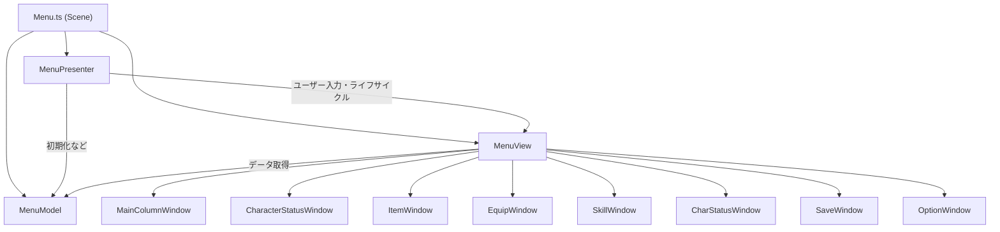

# Menuシーン実装ドキュメント

本ドキュメントでは、Phaserゲーム用[Menu.ts](file:///c:/Users/soushi/Desktop/game/app/%28game%29/scenes/Menu.ts)に適用したMVP(Model-View-Presenter)パターンの構造について説明します。

---

## 1. 全体構造の概要
これまでの[Menu.ts](file:///c:/Users/soushi/Desktop/game/app/%28game%29/scenes/Menu.ts)にすべて集約されていた「データ取得」「画面描画」「入出力の制御」を、それぞれの役割を持つ3つのレイヤー（層）に分割しました。これにより、1つ1つのファイルの記述量が減り、特定のUIパーツや描画の修正が安全に行えるようになっています。

---

## 2. 各コンポーネントの役割

### 1. Scene ([app/(game)/scenes/Menu.ts](file:///c:/Users/soushi/Desktop/game/app/%28game%29/scenes/Menu.ts))
*   **責務**: Phaserのシーンとしての振る舞い（Sceneの登録・切り替え先）と、MVPの各クラスの生成（インスタンス化）に特化した設計です。
*   処理そのものは持たず、作成した [MenuModel](file:///c:/Users/soushi/Desktop/game/app/%28game%29/menu/model/MenuModel.ts#3-65), [MenuView](file:///c:/Users/soushi/Desktop/game/app/%28game%29/menu/view/MenuView.ts#12-75), [MenuPresenter](file:///c:/Users/soushi/Desktop/game/app/%28game%29/menu/presenter/MenuPresenter.ts#5-57) を結びつけ、Phaserのライフサイクル ([init](file:///c:/Users/soushi/Desktop/game/app/%28game%29/scenes/Menu.ts#17-29), [create](file:///c:/Users/soushi/Desktop/game/app/%28game%29/menu/view/MenuView.ts#42-66), [update](file:///c:/Users/soushi/Desktop/game/app/%28game%29/menu/presenter/MenuPresenter.ts#41-45)) をPresenterへ移譲します。

### 2. Model ([app/(game)/menu/model/MenuModel.ts](file:///c:/Users/soushi/Desktop/game/app/%28game%29/menu/model/MenuModel.ts))
*   **責務**: データやロジックの管理・提供を行います。
*   主に以下を取り扱います：
    *   プレイヤーの現在ステータス（HP, MP, 所持金, レベルなど）
    *   所持アイテムのリストと個数
    *   システムごとの設定情報（フォントサイズ・ウィンドウカラー・JSONから読み取る色設定などのグローバルパラメータ）
*   **メリット**: Viewは「どのようなデータか」を気にせず、Modelのメソッド ([getValidItemList()](file:///c:/Users/soushi/Desktop/game/app/%28game%29/menu/model/MenuModel.ts#48-64)など) を呼び出すだけで値を受け取れます。

### 3. View (`app/(game)/menu/view/`)
*   **責務**: Phaserの描画API（`add.text`, `add.graphics`など）を呼び出し、画面上にパーツを配置・アニメーションする処理に専念します。
*   **ファイルの分割**: 巨大な1つのViewクラスになることを防ぐため、各タブの内容ごとにクラスを分けています。
    *   **MenuView.ts**: 全体をとりまとめる役割（ファサード）。以下のパーツを生成して管理します。
    *   **MainColumnWindow.ts**: 上部のタブ一覧、共通の背景枠、選択カーソル（三角マークのTween）、閉じるボタンを作成します。
    *   **CharacterStatusWindow.ts**: 左端のキャラクター画像と簡易ステータス（HP/MP等）
    *   **ItemWindow.ts**: アイテム一覧ページ
    *   **EquipWindow.ts**: 装備一覧ページ
    *   **SkillWindow.ts**: スキル一覧ページ
    *   **CharStatusWindow.ts**: 詳細ステータス一覧ページ
    *   **SaveWindow.ts**: セーブ一覧ページ
    *   **OptionWindow.ts**: オプション一覧ページ

### 4. Presenter (`app/(game)/menu/presenter/MenuPresenter.ts`)
*   **責務**: ModelとViewを連携させる「進行役」です。
*   **役割**: 
    1.  Sceneから `create()` が呼ばれた際、MenuViewの `create()` を呼び出して画面を描画させます。
    2.  ユーザーが「✖（閉じる）ボタン」をクリックしたイベントを受け取ります（Viewには画面遷移の役割を持たせず、Presenterが遷移を管理します）。
    3.  フェードアウト等の終了アニメーションをViewに指示し、それが完了した後に、Menuシーンを終了 (`scene.stop()`) して元のゲーム画面 (`gameScene.resumeScene()`) を再開させます。

---

## 3. 処理の流れの例
**例： 閉じるボタンが押されたとき**
1. ユーザーが `MainColumnWindow` の✖ボタンをクリックする。
2. `MainColumnWindow` はPhaserのイベント機能を使って `'MenuCloseClick'` と発信する。
3. `MenuPresenter` はそのイベントを受け取り、`MenuView.executeEndAnimation()` を呼び出す。
4. `MenuView(MainColumnWindow)` がTweenでフェードアウトアニメーションを再生する。
5. アニメーション完了後、`MenuPresenter` が元のゲームシーンを再開させる。
